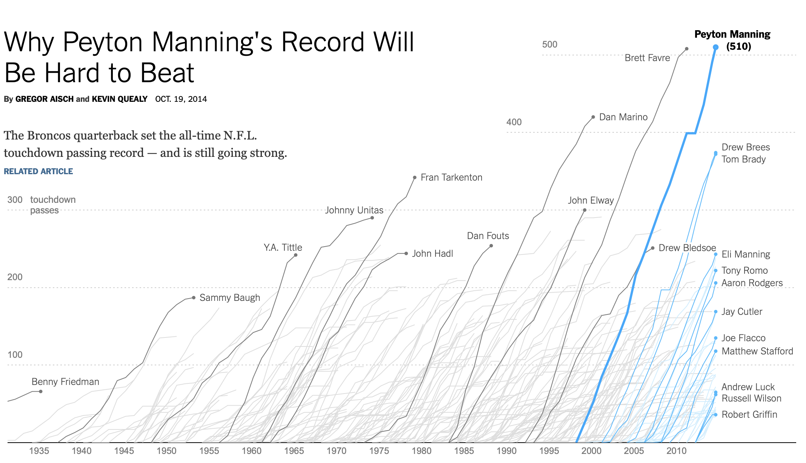
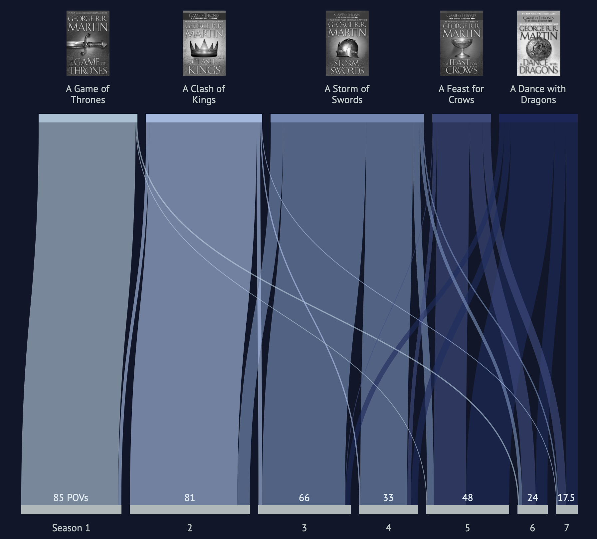
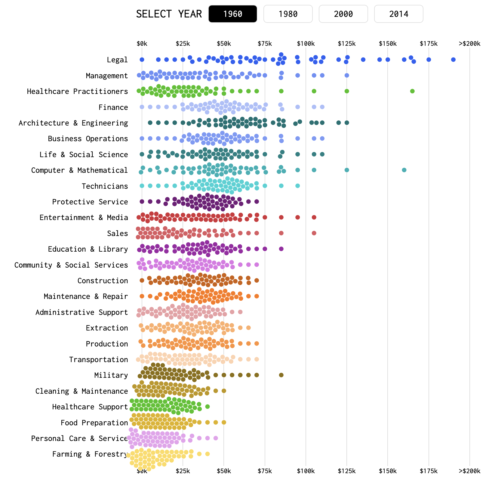

# Assignment 1 - Decoding charts

### Learning Goal
Train yourself in decoding charts so that you can better understand how every single visualization can be described using the language and rules of visual encoding and decomposed into low-level graphical components.

### Instructions

For each of the following charts identify:

- Dataset type
- Data attributes

Use the following template for returning your answers.

- Dataset type:
  - ...

- List of data attributes:
  - Attribute 1, Attribute 2, ...

- For each attribute:
  - Attribute 1 is of type ... encoded as ...
  - Attribute 2 is of type ... encoded as ...
  - ...

NOTE: visit the corresponding link for each chart. Do not use solely the figures provided here.

### Submission

Modify this same README file adding your comments and descriptions after each image.

### Charts

#### Chart 1 - [link](https://archive.nytimes.com/www.nytimes.com/interactive/2012/02/12/us/entitlement-map.html)

... add comments here

#### Chart 2 - [link](http://www.nytimes.com/interactive/2014/10/19/upshot/peyton-manning-breaks-touchdown-passing-record.html)

... add comments here

#### Chart 3 - [link](http://got-books-to-series.surge.sh) [Spoiler alert for GoT]

... add comments here

#### Chart 4 - [link](https://flowingdata.com/2016/06/28/distributions-of-annual-income/)

... add comments here

#### Chart 5 - [link](https://www.ventusky.com)

... add comments here
