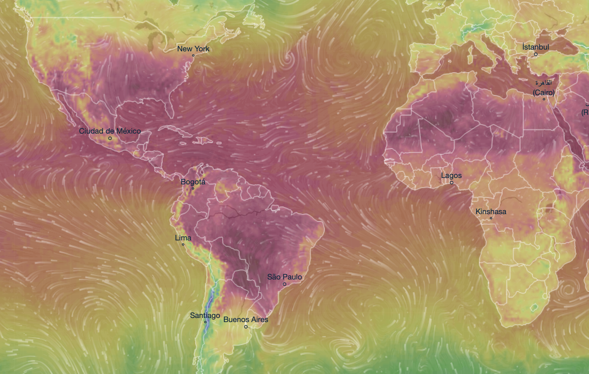

# Assignment 1 - Decoding charts

### Learning Goal
Train yourself in decoding charts so that you can better understand how every single visualization can be described using the language and rules of visual encoding and decomposed into low-level graphical components.

### Instructions

For each of the following charts identify:

- Dataset type
- Data attributes

Use the following template for returning your answers.

- Dataset type:
  - ...

- List of data attributes:
  - Attribute 1, Attribute 2, ...

- For each attribute:
  - Attribute 1 is of type ... encoded as ...
  - Attribute 2 is of type ... encoded as ...
  - ...

NOTE: visit the corresponding link for each chart. Do not use solely the figures provided here.

### Submission

Modify this same README file adding your comments and descriptions after each image.

### Charts

#### Chart 1 - [link](https://archive.nytimes.com/www.nytimes.com/interactive/2012/02/12/us/entitlement-map.html)

... add comments here:

Dataset Type : Geometry

List of Data Attributes:

1. All Government Benefits percent of county income
2. Social Security percent of county income
3. Medicare percent of county income
4. Medicaid percent of county income
5. Income Support percent of county income
6. Veterans Benefits percent of county income
7. Unemployment Insurance percent of county income
8. Year
9. Name of county
10. U.S. Average of All Government Benefits percent of county income (on hovering over a county) 
11. U.S. Average of Social Security percent of county income (on hovering over a county) 
12. U.S. Average of Medicare percent of county income (on hovering over a county) 
13. U.S. Average of Medicaid percent of county income (on hovering over a county) 
14. U.S. Average of Income Support percent of county income (on hovering over a county) 
15. U.S. Average of Veterans Benefits percent of county income (on hovering over a county) 
16. U.S. Average of Unemployment Insurance percent of county income (on hovering over a county) 

------------------------------------------------------------------------------------------

Attribute : All Government Benefits percent of county income

Attribute Type : Ordinal

Encoded as(channel): Color (Saturation) 

------------------------------------------------------------------------------------------

Attribute : Social Security percent of county income

Attribute Type : Ordinal

Encoded as(channel): Color (Saturation)  

------------------------------------------------------------------------------------------

Attribute : Medicare percent of county income

Attribute Type : Ordinal

Encoded as(channel): Color (Saturation) 

------------------------------------------------------------------------------------------

Attribute : Medicaid percent of county income

Attribute Type : Ordinal

Encoded as(channel): Color (Saturation)

------------------------------------------------------------------------------------------

Attribute : Income Support percent of county income

Attribute Type : Ordinal

Encoded as(channel): Color (Saturation)  

------------------------------------------------------------------------------------------

Attribute : Veterans Benefits percent of county income

Attribute Type : Ordinal

Encoded as(channel): Color (Saturation)  

------------------------------------------------------------------------------------------

Attribute : Unemployment Insurance percent of county income

Attribute Type : Ordinal

Encoded as(channel): Color (Saturation)  

------------------------------------------------------------------------------------------

Attribute : Time (Year)

Attribute Type : Ordinal

Encoded as(channel): Shape (Letters)

------------------------------------------------------------------------------------------

Attribute : Location of county 

Attribute Type : Categorical

Encoded as(channel): Shape 

------------------------------------------------------------------------------------------

Attribute : All the U.S.Averages mentioned ( attribute 10 to attribute 16)

Attribute Type : Quantitative

Encoded as(channel): Position(Horizontal and Vertical)-  (on hovering over a county) 

------------------------------------------------------------------------------------------

#### Chart 2 - [link](http://www.nytimes.com/interactive/2014/10/19/upshot/peyton-manning-breaks-touchdown-passing-record.html)

... add comments here

Dataset Type : Table

List of Data Attributes: 
1. Time
2. Player’s Total count of Touchdown passes after each year from 1935 to 2014
3. Name of the Player

Attribute : Time (Years)

Attribute Type : Ordinal

Encoded as(channel): Position (Horizontal)

------------------------------------------------------------------------------------------

Attribute : Player’s Total count of Touchdown passes after each year

Attribute Type :Categorical

Encoded as(channel): Position (Vertical)

------------------------------------------------------------------------------------------

Attribute : Name of the Player

Attribute Type :Categorical

Encoded as(channel): Shape (letters)

------------------------------------------------------------------------------------------

#### Chart 3 - [link](http://got-books-to-series.surge.sh) [Spoiler alert for GoT]

... add comments here

Dataset Type : Network

List of Data Attributes:

1.Book Name 
2.Season Number 
3.Number of POV's copied:

* Number of POVS copied From “A Game of thrones" to Season 1
* Number of POVS copied From “A Game of thrones" to Season 2
* Number of POVS copied From “A Game of thrones" to Season 3
* Number of POVS copied From “A Game of thrones" to Season 4
* Number of POVS copied From “A Game of thrones" to Season 5
* Number of POVS copied From “A Game of thrones" to Season 6
* Number of POVS copied From “A Game of thrones" to Season 7

* Number of POVS copied From “A Clash of Kings" to Season 1
* Number of POVS copied From “A Clash of Kings" to Season 2
* Number of POVS copied From “A Clash of Kings" to Season 3
* Number of POVS copied From “A Clash of Kings" to Season 4
* Number of POVS copied From “A Clash of Kings" to Season 5
* Number of POVS copied From “A Clash of Kings" to Season 6
* Number of POVS copied From “A Clash of Kings" to Season 7

* Number of POVS copied From “Storm of Swords" to Season 1
* Number of POVS copied From “Storm of Swords" to Season 2
* Number of POVS copied From “Storm of Swords" to Season 3
* Number of POVS copied From “Storm of Swords" to Season 4
* Number of POVS copied From “Storm of Swords" to Season 5
* Number of POVS copied From “Storm of Swords" to Season 6
* Number of POVS copied From “Storm of Swords" to Season 7

* Number of POVS copied From “A feast for crows" to Season 1
* Number of POVS copied From “A feast for crows" to Season 2
* Number of POVS copied From “A feast for crows" to Season 3
* Number of POVS copied From “A feast for crows" to Season 4
* Number of POVS copied From “A feast for crows" to Season 5
* Number of POVS copied From “A feast for crows" to Season 6
* Number of POVS copied From “A feast for crows" to Season 7

* Number of POVS copied From “A dance with dragons" to Season 1
* Number of POVS copied From “A dance with dragons" to Season 2
* Number of POVS copied From “A dance with dragons" to Season 3
* Number of POVS copied From “A dance with dragons" to Season 4
* Number of POVS copied From “A dance with dragons" to Season 5
* Number of POVS copied From “A dance with dragons" to Season 6
* Number of POVS copied From “A dance with dragons" to Season 7

------------------------------------------------------------------------------------------

Attribute : Book Name 

Attribute Type :Ordinal (Book series are chronological)

Encoded as(channel): 

Attribute : Season Number

Attribute Type :Ordinal (Book seasons are chronological)

Encoded as(channel): 

Attribute : Number of POV's copied

Attribute Type : Quantitative 

Encoded as(channel): Color(Saturation) + Area 

------------------------------------------------------------------------------------------

#### Chart 4 - [link](https://flowingdata.com/2016/06/28/distributions-of-annual-income/)

... add comments here

Dataset Type : Geometry

List of Data Attributes:

1. Time
2. Name of the Departments 
3. Salary belongs to which Department?
4. Salary Amount

------------------------------------------------------------------------------------------

Attribute : Time

Attribute Type : Ordinal

Encoded as(channel): color. 

Reason: On selection, Background color of Time changes to black. Font Color of time changes to white.

------------------------------------------------------------------------------------------

Attribute : Name of the Departments

Attribute Type : Categorical

Encoded as(channel): Position(Vertical).

------------------------------------------------------------------------------------------

Attribute : Salary belongs to which Department?

Attribute Type : Categorical

Encoded as(channel): Colors(hue+saturation)
 
------------------------------------------------------------------------------------------

Attribute : Salary Amount

Attribute Type : Ordinal

Encoded as(channel): Position(Horizontal).

------------------------------------------------------------------------------------------

#### Chart 5 - [link](https://www.ventusky.com)

... add comments here

5.Dataset Type : Field

List of Data Attributes:

1. Temperature
2. Perceived Temperature
3. Precipitation
4. Radar
5. Clouds Percentage
6. Wind speed
7. Wind gusts
8. Air pressure
9. Thunderstorm Power
10. Humidity(Relative)
11. Humidity(Dew Point)
12. Waves (Height)
13. Waves Duration
14. Snow cover
15. Freezing level
16. Date
17. Time of the Day
18. Precipitation Accumulation
19. Altitude above the ground 
20. Type of Clouds
21. Animation Level for Wind.

------------------------------------------------------------------------------------------

Attribute : Temperature 

Attribute Type : Ordinal

Encoded as(channel): Color(hue)

------------------------------------------------------------------------------------------

Attribute : Perceived Temperature 

Attribute Type : Ordinal

Encoded as(channel): Color(hue)

------------------------------------------------------------------------------------------

Attribute : Precipitation

Attribute Type : Ordinal

Encoded as(channel): Color(hue+Saturation)

------------------------------------------------------------------------------------------

Attribute : Radar

Attribute Type : Ordinal

Encoded as(channel): Color(hue)

------------------------------------------------------------------------------------------

Attribute : Clouds Percentage

Attribute Type : Ordinal

Encoded as(channel): Color(Luminance) 

------------------------------------------------------------------------------------------

Attribute : Wind Speed

Attribute Type : Ordinal

Encoded as(channel): Color(hue)

------------------------------------------------------------------------------------------

Attribute : Wind Gusts

Attribute Type : Ordinal

Encoded as(channel): Color(hue)

------------------------------------------------------------------------------------------

Attribute : Air Pressure

Attribute Type : Ordinal

Encoded as(channel): Color(hue)

------------------------------------------------------------------------------------------

Attribute : Thunderstorm Power

Attribute Type : Ordinal

Encoded as(channel): Color(hue)

------------------------------------------------------------------------------------------

Attribute : Humidity(Relative)

Attribute Type : Ordinal

Encoded as(channel): Color(Luminance)

------------------------------------------------------------------------------------------

Attribute : Humidity(Due Point)

Attribute Type : Ordinal

Encoded as(channel): Color(hue)

------------------------------------------------------------------------------------------

Attribute : Waves (height)

Attribute Type : Ordinal

Encoded as(channel): Color(hue)

------------------------------------------------------------------------------------------

Attribute : Waves (Period)

Attribute Type : Ordinal

Encoded as(channel): Color(hue)

------------------------------------------------------------------------------------------

Attribute : Snow Cover

Attribute Type : Ordinal

Encoded as(channel): Color(hue +Luminance)

------------------------------------------------------------------------------------------

Attribute : Freezing Level

Attribute Type : Ordinal

Encoded as(channel): Color(hue +Saturation)

------------------------------------------------------------------------------------------

Attribute : Date 

Attribute Type : Quantitative (Reason: We can compare two dates to see if the weather gets better or Worse with days)

Encoded as(channel): Shape(letters)

------------------------------------------------------------------------------------------

Attribute : Time of the Day 

Attribute Type : Quantitative (Reason: We can compare two dates to see if the weather gets warmer or colder with time)

Encoded as(channel): Position(Horizontal)

------------------------------------------------------------------------------------------

Attribute : Precipitation Accumulation

Attribute Type : Categorical

Encoded as(channel): Drop Down (Pick-list)

------------------------------------------------------------------------------------------

Attribute : Type of Clouds

Attribute Type : Categorical

Encoded as(channel): Drop Down (Pick-list)

------------------------------------------------------------------------------------------

Attribute : Altitude above the ground 

Attribute Type : Ordinal

Encoded as(channel): Drop Down (Pick-list)

------------------------------------------------------------------------------------------

Attribute : Type of Clouds

Attribute Type : Categorical

Encoded as(channel): Drop Down (Pick-list)

------------------------------------------------------------------------------------------

Attribute : Animation Level for Wind.

Attribute Type : Categorical

Encoded as(channel): Drop Down (Pick-list)

------------------------------------------------------------------------------------------

